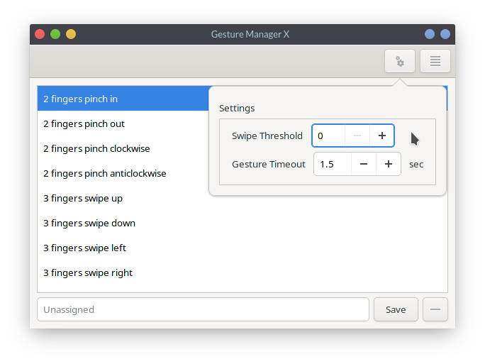

# Gestures Manager X

Graphical manager for setting libinput-gestures touchpad gestures.

## Installing

Please read [libinput-gestures](https://github.com/bulletmark/libinput-gestures) first.

### Arch Linux

You can find the `gesture-manager-x-git` package on AUR.

### Other distributions

Dependencies:
- libinput as your default touchpad driver
- [libinput-gestures](https://github.com/bulletmark/libinput-gestures)
- python3
- gtk+>=3.18

Once you have installed all the dependencies, clone this repository
~~~
git clone https://github.com/RitwickVerma/Gesture-Manager-X
~~~

Then all you have to do is opening the newly cloned folder, and running `main.py` (either using `python3 main.py` or simply `./main.py`).

## Disclaimer
This is a fork of [gestureManager](https://github.com/GabMus/gestureManager) by [GabMus](https://github.com/GabMus) with added gestures and settings available in [libinput-gestures](https://github.com/bulletmark/libinput-gestures).
